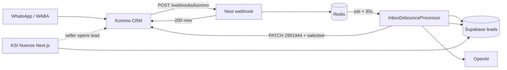
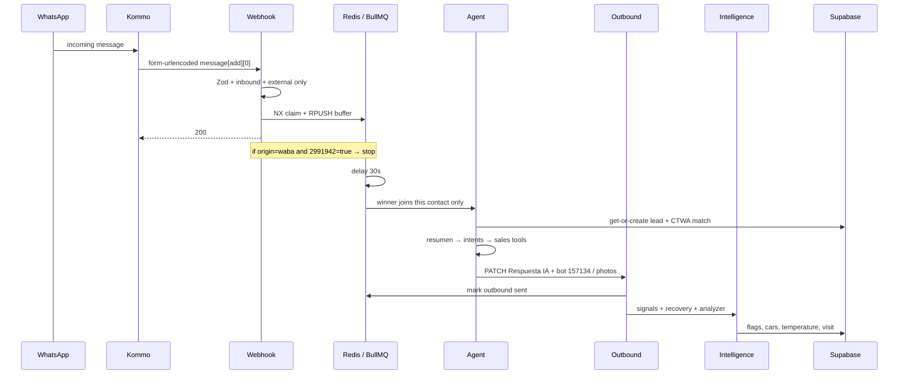

# KSI FAG Motors — Inbound AI Backend

**NestJS worker that replaces the n8n WhatsApp sales bot** for [FAG MOTORS / KSI NUEVOS](https://ksinuevos.com) — a new-vehicle dealer in Cuenca, Ecuador.

Kommo stays the conversation channel (WhatsApp / WABA). This service is the **AI first-response engine**: it receives the webhook, waits 30 seconds, talks to the customer, then writes signals back to Supabase so the [dealership web app](https://github.com/fagmotorssistemas/KsiNuevos_Frontend) can show temperature, visits, trade-in, and recovery.

It is **not** the full dealership OS (sales UI, accounting, marketing). That lives in the Next.js platform. This repo is the inbound automation layer that used to be a ~200-node n8n workflow.

---

## Why this project matters

| Area | What this backend delivers |
|------|----------------------------|
| **AI first contact** | Same movie as n8n, different machine: webhook → debounce → LLM → Kommo salesbot |
| **Isolation** | Ana asking for a Hilux and Paula asking for financing never share buffer, memory, or outbound |
| **CRM write-back** | Leads, `interested_cars`, trade-in, `behavior_signals`, temperature, visit time, recovery replies |
| **Media** | Voice → Whisper; photos → vision (`gpt-4o-mini`) so the agent sees what the customer sent |
| **Human takeover** | Kommo checkbox `atiende IA?` (field **2991942**) turns the bot off for that lead |

n8n can stay live behind a feature flag / parallel run. This codebase does **not** copy n8n 1:1 (67 photo HTTP nodes → one sender + `vehicle_salesbots` table).

---

## Authorship

| Role | Name | Links |
|------|------|--------|
| **Author** | Nathaly Caballero | [GitHub @Nathaly222](https://github.com/Nathaly222) |

---

## Tech stack

| Layer | Technologies |
|-------|----------------|
| **Runtime** | [NestJS 11](https://nestjs.com), TypeScript, Express |
| **Queue** | [BullMQ](https://docs.bullmq.io) + [Redis](https://redis.io) (ioredis) |
| **Validation** | [Zod](https://zod.dev) |
| **CRM** | [Kommo](https://www.kommo.com) REST (`/api/v4`, salesbot `/api/v2/salesbot/run`) |
| **AI** | [OpenAI](https://openai.com) — chat, tools, embeddings, Whisper, vision |
| **Data** | [Supabase](https://supabase.com) (service role, RPC `fn_match_lead_to_ctwa_click`, `match_inventoryoracle`) |
| **Tests** | Jest (~100 unit tests on parsers, debounce, persistence, intelligence) |

---

## How everything connects



Kommo does **not** wait 30 seconds on the HTTP POST. The Wait of n8n is internal: here it is a delayed BullMQ job.

### Isolation (Ana ≠ Paula)

Every hop is keyed by `contactId`:

| Piece | Key |
|-------|-----|
| Dedup | `inbox:msg:{contactId}:{messageId}` |
| Debounce list | `inbox:buf:{contactId}` |
| Job | `inbox-flush:{contactId}:{messageId}` |
| Already sent | `inbox:out:{contactId}:{messageId}` |
| Chat memory | `conversation:mem:{contactId}` |

The agent is a Nest singleton, but it does **not** store “current customer” on the instance. Each `handleTurn({ contactId, customerText })` loads only that contact’s Redis history. Two jobs at the same millisecond do not mix text, memory, or WhatsApp `lead_id`.

Same person in 30 s (“hola” + “hilux”) **is** joined — that is debounce, not a leak.

### Sequence (one winning message)



---

## Pipeline in detail

### 1. Webhook (`POST /webhooks/kommo`)

- Body: `application/x-www-form-urlencoded`, keys like `message[add][0][contact_id]` (flat) or nested `qs`.
- Accept only `type=incoming` + `author.type=external`.
- Always HTTP **200** (Kommo retries otherwise).
- WABA: GET lead; if custom field **2991942** is true → `bot_stopped`, no queue.

### 2. Media

| Kind | What happens |
|------|----------------|
| text | as-is |
| voice | download + Whisper |
| picture | download + vision prompt (same as n8n) |

### 3. Inbox / debounce

- 30 s delay (`DEBOUNCE_DELAY_MS`).
- Winner = **last `messageId`** in that contact’s list (not last text).
- Loser does **not** delete the list.
- Job `attempts: 1`. After Kommo send, mark `inbox:out:{contactId}:{messageId}` so that pair is not sent twice.

### 4. Lead + CTWA

- Get-or-create `leads` by `contact_id`.
- RPC `fn_match_lead_to_ctwa_click` if there is a usable phone.
- If the click and the message are ≤ 60 s apart, the ad vehicle is annotated on the **joined** debounce text (n8n used the raw webhook text).

### 5. Agent (4 OpenAI calls today)

| Call | Role |
|------|------|
| Resumen | What the customer wants **now** (prompt copied from n8n) |
| Intents | Which `agent_prompts` rows to load |
| Sales agent | Tools: `buscarvehiuclo` (typo kept on purpose), financing calculators |
| Lead analyzer | Structured JSON: financing, trade-in, signals, visit_time |

Prompts are **not** rewritten. Output of the sales agent is parsed once (`parseAgentOutput`) — one parser, not several n8n “Parser Datos”.

### 6. Outbound

1. PATCH lead field **2991944** (`Respuesta IA`).
2. POST salesbot **157134** (text). Photos: same endpoint, `bot_id` from `vehicle_salesbots` (inventory_id first, then up to 4 `img_prefix`).

Salesbot **187553** (new contact) exists as a constant; it is not the main text path.

### 7. Intelligence (after WhatsApp)

Rule-based pass on the **agent reply** + resumen (n8n Codes: falta de datos, financiamiento, presupuesto, fotos, llamada). Then optional analyzer on the **customer** message.

| Write | When |
|-------|------|
| `interested_cars` | New `inventory_id` for that lead — insert, never update, never duplicate the same car |
| `datos_solicitados_clientes` | “no tengo ese dato exacto…” |
| `asesoria_financiamiento` | Advisor + financing handoff (not the OR with missing-data) |
| `leads` flags | `respondio_post_fotos`, `quiere_llamada`, `presupuesto_cliente`, status |
| `lead_recovery` | If `mensajes_enviados` has 2d/7d/15d/30d — classify reply |
| `behavior_signals` + `temperature` | Merge OR + score (frío / tibio / caliente) |
| `day_detected` / `hour_detected` / `time_reference` | Visit datetime in America/Guayaquil |
| `trade_in_cars` | Brand/model/year; `condition` = `bueno` |

If intelligence fails, WhatsApp already went out. That is intentional.

---

## Modules (who talks to whom)

```
Webhook → Inbox, CRM, Media
InboxDebounceProcessor → Persistence, Conversation, Agent, Outbound, Intelligence
Agent → Catalog, Conversation, OpenAI, dealership hours / financing helpers
Intelligence → Persistence, Conversation, OpenAI (analyzer only)
Outbound → CRM, Catalog
Catalog / Persistence → same SUPABASE_GATEWAY
```

No `forwardRef`. The processor is the only orchestrator.

| Module | Responsibility |
|--------|----------------|
| `webhook` | Parse + Zod + accept/reject |
| `inbox` | Dedup, buffer, queue, sent flag |
| `media` | Kind + Whisper / vision |
| `crm` | Kommo GET/PATCH/salesbot, phone, bot-stopped |
| `conversation` | Redis memory + CTWA text merge |
| `persistence` | Supabase gateway (no Nest Config in the service — Jest-friendly) |
| `catalog` | `agent_prompts`, vector inventory, photo bots |
| `agent` | Four-step LLM turn |
| `outbound` | One text path + photo bots |
| `intelligence` | Pure functions + `afterReply` |
| `handoff` | Empty — seller assignment map from n8n was **not** copied |

---

## Data this service touches

| Table / store | Use |
|---------------|-----|
| `leads` | Mirror + flags + temperature + visit |
| `interested_cars` | Which inventory this lead asked about |
| `trade_in_cars` | Retoma |
| `datos_solicitados_clientes` | Missing catalog facts |
| `asesoria_financiamiento` | Financing handoff |
| `lead_recovery` | Answers to 2d/7d/15d/30d |
| `vehicle_salesbots` | `bot_id` per car / prefix |
| `agent_prompts` | Dynamic sales system sections |
| Redis | Debounce, anti-dupe, outbound mark, last 24 messages |
| `n8n_chat_histories` | Durable chat: `human` = cliente, `ai` = respuesta del bot. Never `RESUMEN PREVIO` as human. |

Two `lead_id` meanings: Kommo id for `vehicle_uid` (FNV-1a `lead_id\|inventory_id`); Supabase `leads.id` for child tables.

---

## What was not copied from n8n (on purpose)

- 67 Switch+HTTP photo nodes → table + one client
- Hardcoded seller UUIDs (`responsable` → `assigned_to`)
- Dead Ifs (country, `If9` empty exits, unused GET-with-PATCH-body)
- Second 30 s wait / orphan Redis deletes
- Hardcoded lead `30296877` (excluded constant only)
- Re-sending the same WhatsApp after the analyzer (n8n did PATCH + bot again)

---

## Project structure

```
src/
├── config/                 # Zod env + Nest Config
├── common/redis|queue/     # ioredis + BullMQ connection
├── health/
└── modules/
    ├── webhook/            # POST /webhooks/kommo
    ├── inbox/              # debounce + processor
    ├── media/
    ├── crm/
    ├── conversation/
    ├── persistence/
    ├── catalog/
    ├── agent/              # prompts/, tools, parser
    ├── outbound/
    ├── intelligence/       # analyze, recovery, visit, temperature
    └── handoff/            # reserved
supabase/                   # vehicle_salesbots.sql
```

---

## Getting started

### Prerequisites

- Node.js 20+
- Redis
- Kommo private token
- OpenAI API key
- Supabase project (service role) + `vehicle_salesbots` rows loaded

### Install & run

```bash
npm install
cp .env.example .env
npm run start:dev
```

Webhook: `POST http://localhost:3000/webhooks/kommo`.

### Tests

```bash
npm test
```

Services used in specs must not import `@nestjs/config` or `@nestjs/bullmq` (ESM). Tokens: `KOMMO_CONFIG`, `OPENAI_*`, `INBOX_DEBOUNCE_QUEUE_CLIENT`, `SUPABASE_GATEWAY`.

### Environment

| Variable | Purpose |
|----------|---------|
| `KOMMO_BASE_URL` | e.g. `https://marketingfagmotorsurfacom.kommo.com` |
| `KOMMO_TOKEN` | Bearer for Kommo API |
| `OPENAI_API_KEY` | Chat, tools, Whisper, vision, embeddings |
| `OPENAI_MODEL` | Default `gpt-4.1-mini` |
| `OPENAI_EMBEDDING_MODEL` | Must match the inventory vector column (`text-embedding-3-small`) |
| `REDIS_URL` | Queue + memory |
| `SUPABASE_URL` | Project URL |
| `SUPABASE_SERVICE_ROLE_KEY` | Server writes |
| `DATABASE_URL` | Present in env schema (direct `pg` reserved) |

Empty OpenAI / Kommo / Supabase keys: that I/O is skipped with a warning (local boot without secrets).

Never commit `.env`.

---

## Design principles

- **Same product, not the same graph.** n8n nodes are folded into functions (`analyzeTurn`, `planLeadSignalWrites`) instead of 1:1 workers.
- **Webhook is cheap.** Heavy work is the job.
- **Customer first.** Persist CRM after outbound; a failed UPDATE must not swallow WhatsApp.
- **One contact, one execution context.** Keys always include `contactId`.
- **Prompts stay.** Changing sales copy is a product decision, not a refactor.
- **Keep the typo `buscarvehiuclo`** until the tool name in the prompt is migrated.

---

## Still open (honest)

- `HandoffModule` is empty (no seller map).
- Feature flag per lead to flip n8n vs Nest in production may live outside this repo.
- Recovery columns only update if another flow already set `mensajes_enviados`.
- Fourth LLM call (analyzer) can fail silently after a successful reply.
- If the process dies **after** Redis memory write and **before** Kommo, `attempts: 1` + deleted buffer means no automatic resend (silence, not a mix-up).

---

## License & usage

Proprietary software for **FAG MOTORS / KSI NUEVOS**. All rights reserved by the client organization.

---

## Contact

- **Nathaly Caballero** — [github.com/Nathaly222](https://github.com/Nathaly222)

*NestJS inbound AI for Kommo + WhatsApp, built to retire the n8n sales workflow without mixing customers.*
